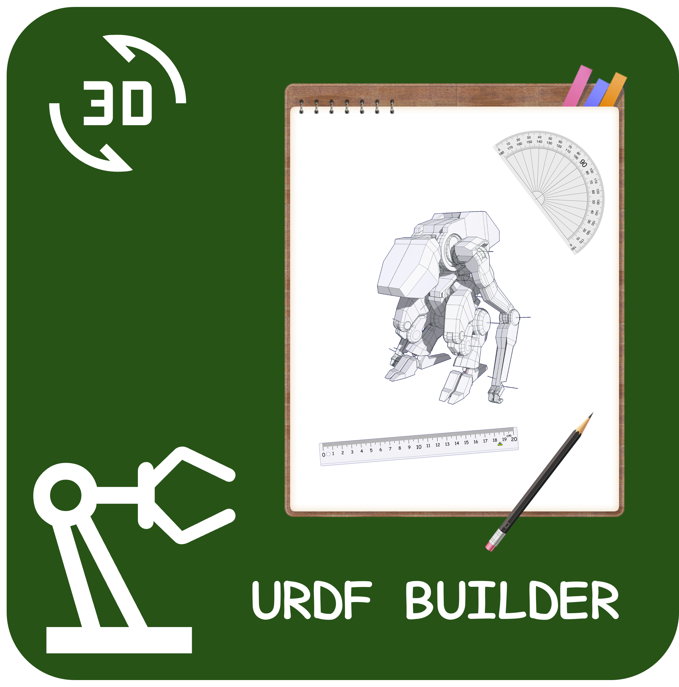
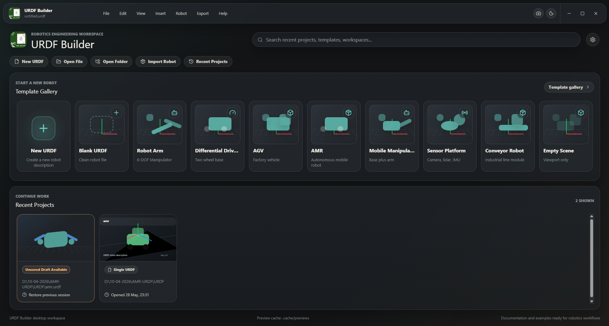
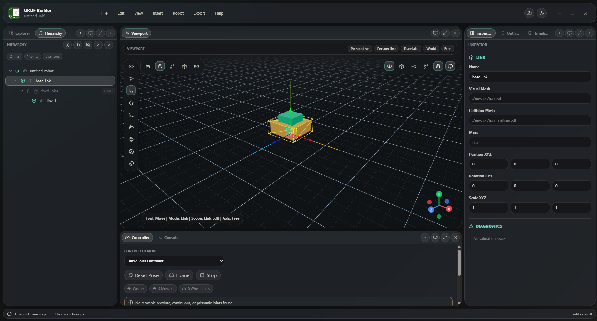
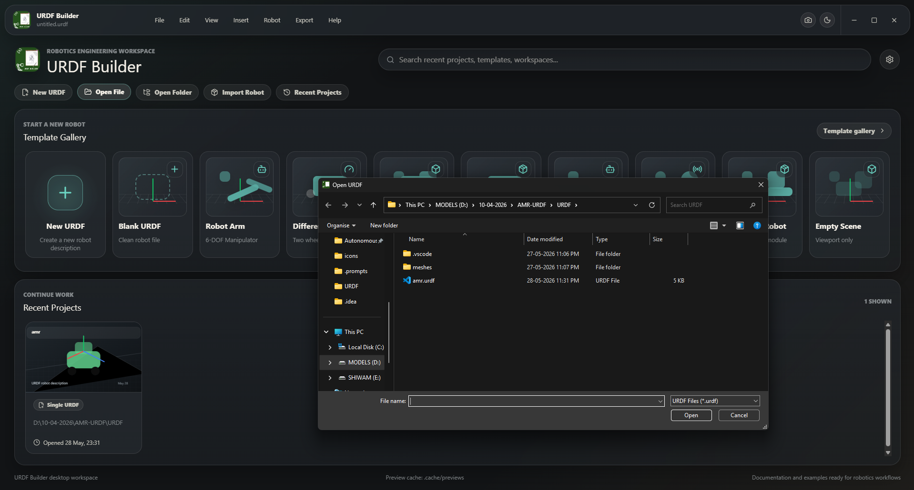
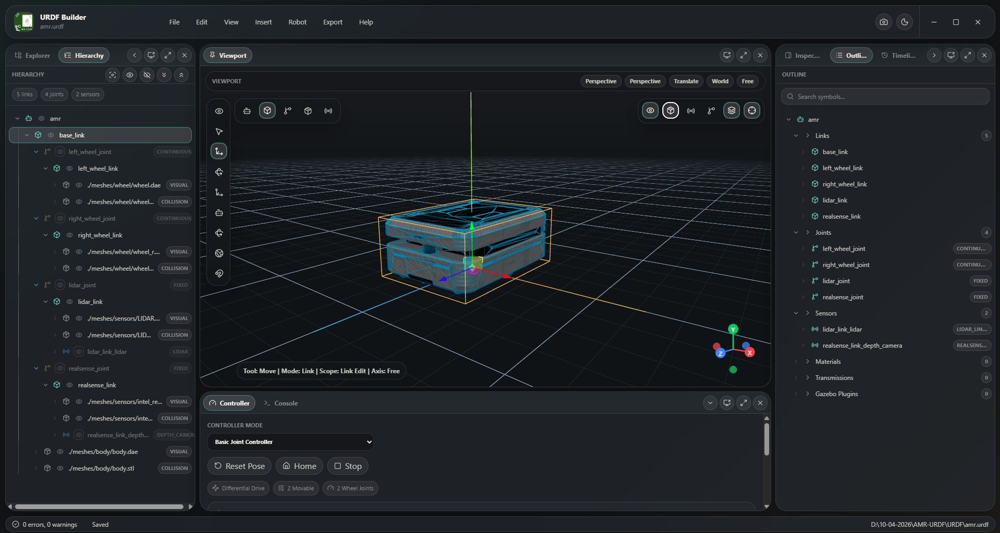

<div align="center">
  

  <h1>URDF Builder 2.0</h1>

  <p>
    A modern Electron workbench for authoring, inspecting, transforming, and packaging URDF robot descriptions.
  </p>

  <p>
    
    
    
    
    
  </p>
</div>

<br />

<picture>
  <source media="(prefers-color-scheme: dark)" srcset="readme_assets/01.png" />
  
</picture>

## One UI Inspired Robotics Workspace

URDF Builder 2.0 is shaped like a desktop robotics studio instead of a plain XML editor. It combines a soft One UI-inspired shell, a CAD-style 3D viewport, Monaco editing, robot hierarchy tools, diagnostics, timeline history, and native Electron file workflows.

<table>
  <tr>
    <td width="33%">
      <strong>Modern Startup</strong><br />
      Dashboard-first launch with templates, recent robots, draft recovery, native open flows, and fast access to URDF workspaces.
    </td>
    <td width="33%">
      <strong>Robotics CAD Viewport</strong><br />
      Three.js viewport with grid, axes, transform tools, local/world modes, snapping, visibility layers, and selection outlines.
    </td>
    <td width="33%">
      <strong>Editor Workbench</strong><br />
      Dockable panels, Monaco tabs, XML outline, timeline, diagnostics, controller preview, and detached Electron windows.
    </td>
  </tr>
</table>

## Preview

<table>
  <tr>
    <td>
      
    </td>
  </tr>
  <tr>
    <td align="center"><strong>Dockable workbench with viewport, hierarchy, inspector, and controller panels</strong></td>
  </tr>
</table>

<table>
  <tr>
    <td width="50%">
      
    </td>
    <td width="50%">
      
    </td>
  </tr>
  <tr>
    <td align="center"><strong>Native Electron file workflow</strong></td>
    <td align="center"><strong>Loaded AMR robot with visual and collision layers</strong></td>
  </tr>
</table>

> Full motion preview: [readme_assets/_001.mp4](readme_assets/_001.mp4)

## Feature Matrix

| Area | What It Does |
| --- | --- |
|  Dashboard | Template gallery, recent projects, pending draft recovery, search-first startup, and dashboard-first launch. |
|  Viewport | Orbit navigation, perspective/orthographic camera, transform gizmo, grid, axes, shadows, visibility layers, and selectable URDF entities. |
|  Hierarchy | Robot/link/joint/sensor/mesh tree with recursive expand/collapse, selection sync, isolate/reveal, and context actions. |
|  Monaco Editor | XML/URDF editing, tabs, split editor foundation, breadcrumbs, format action, completions, hover docs, and symbol focus. |
|  TF / Outline | TF-style relationship panel, XML outline, link/joint/sensor/material/transmission/plugin symbol groups. |
|  Sync Pipeline | Separate editor draft XML, last valid robot model, and scene render buffer for stable real-time editing. |
|  Transform Safety | Move/rotate/scale isolation, cached gizmo commits, undo/redo history, and root-vs-entity transform ownership. |
|  Native Files | Open/save/save-as, open folder, recent files, package export, mesh path resolution, and `package://` support. |
|  Diagnostics | URDF validation, missing mesh warnings, controller validation, console panel, status bar, and save confirmation feedback. |
|  Desktop Shell | Frameless Electron windows, detachable panels, persisted layout, dark/light theme, and Windows installer builds. |

## Robotics Workflow

1. Start from the dashboard and create a clean robot, open a URDF, or open a robot package folder.
2. Inspect the imported hierarchy, meshes, joints, sensors, diagnostics, and XML outline.
3. Edit URDF fields in Monaco or use the viewport gizmo for visual transforms.
4. Preview joint/controller behavior without mutating the authored URDF.
5. Save the URDF or export a portable package with mesh references rewritten into `./meshes`.

## Tech Stack

| Layer | Stack |
| --- | --- |
| Desktop | Electron, Electron Builder, context-isolated preload bridge |
| App | React 19, TypeScript, Vite, Zustand |
| 3D | Three.js, React Three Fiber, Drei, URDF Loader |
| Editor | Monaco Editor, fast-xml-parser, xmlbuilder2 |
| Styling | Custom workbench CSS with One UI-inspired dark surfaces, compact cards, teal accents, and Windows 11-style chrome |

## Getting Started

```powershell
git clone https://github.com/kazuha-alice/URDF-BUILDER-2.0.git
cd URDF-BUILDER-2.0
npm install
npm run dev
```

`npm run dev` starts Vite and launches the Electron desktop app.

## Scripts

| Command | Purpose |
| --- | --- |
| `npm run dev` | Start the Electron development app. |
| `npm run dev:vite` | Start only the Vite server for browser debugging. |
| `npm run build` | Type-check and build the renderer. |
| `npm run start` | Launch Electron against the production `dist` build. |
| `npm run build:electron` | Build the Windows unpacked app and NSIS installer. |
| `npm run lint` | Run ESLint. |

## Windows Distribution

```powershell
npm run build:electron
```

Build outputs are written to `project/electron/`:

| Output | Description |
| --- | --- |
| `project/electron/win-unpacked/URDF Builder.exe` | Portable unpacked Windows app. |
| `project/electron/URDF-Builder-Setup-0.0.0.exe` | NSIS installer. |

The distribution folder is intentionally ignored by Git.

## Repository Hygiene

The project keeps generated and local-only files out of source control:

| Ignored | Why |
| --- | --- |
| `node_modules/`, `dist/`, `dist-ssr/` | Dependency and build output. |
| `project/`, `.release/` | Packaged Electron artifacts. |
| `.agents/`, `.prompts/`, `.idea/` | Local agent memory, prompts, and IDE metadata. |
| `.env*`, logs, caches, temporary files | Machine-specific runtime data. |

## Roadmap

| Focus | Notes |
| --- | --- |
| Xacro workflow | Better package-level authoring and preprocessing. |
| More mesh formats | OBJ, GLB, and GLTF loader support. |
| Advanced controllers | Richer ROS control previews and authored controller metadata. |
| Editor persistence | Full save support for non-URDF tabs and workspace side files. |
| Performance | Route/editor code splitting for the Monaco and Three.js bundle. |

## License

Licensed under the Apache License 2.0. See [LICENSE](LICENSE).

<div align="center">
  <sub>Built for robot builders who want the XML, the model, and the viewport to stay in one calm workspace.</sub>
</div>
